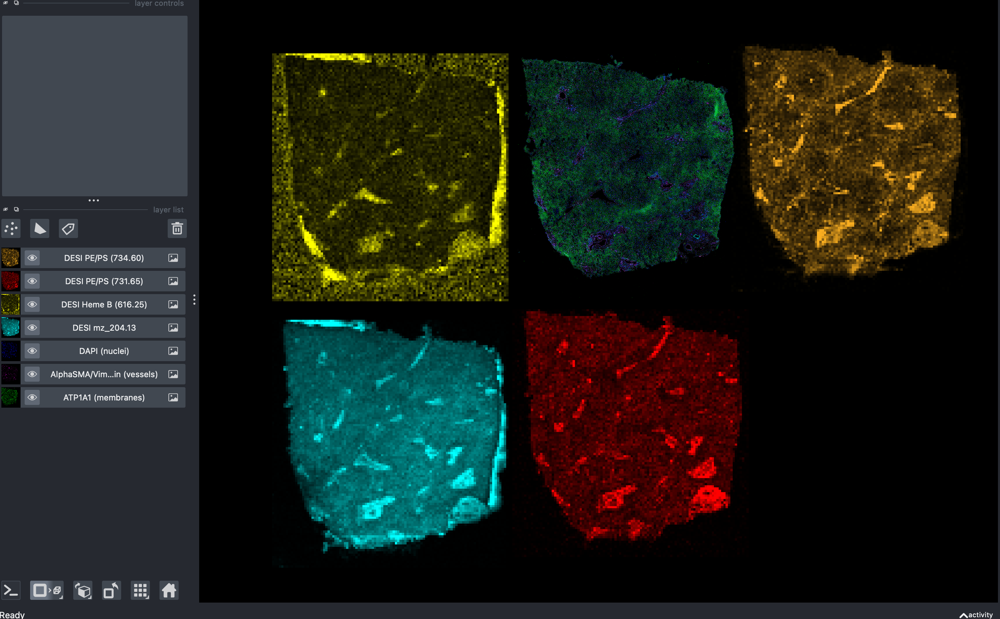
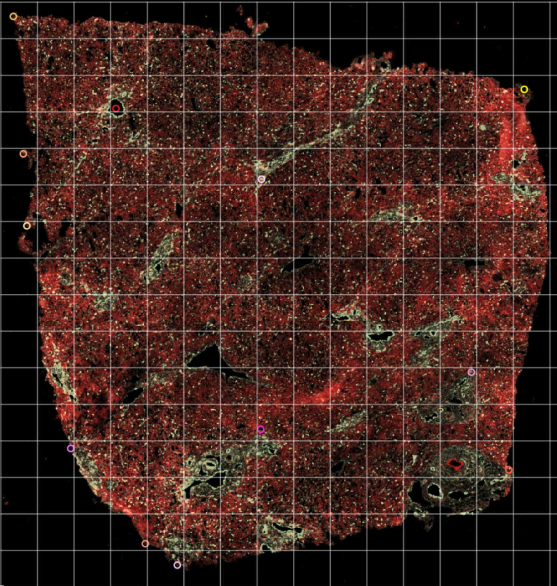
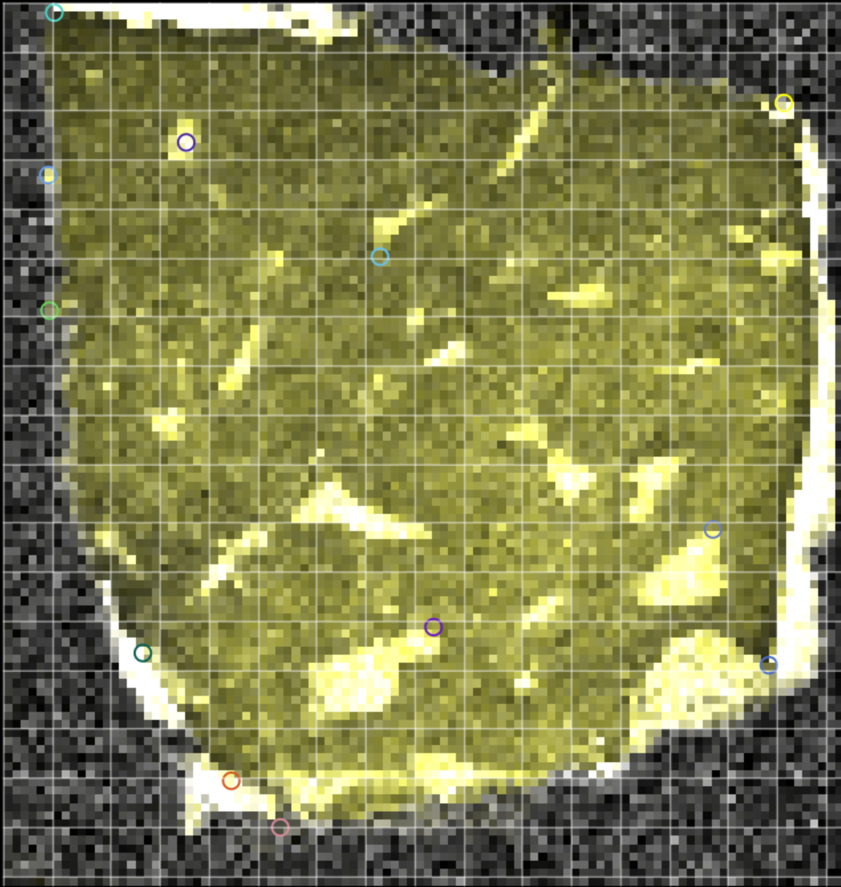
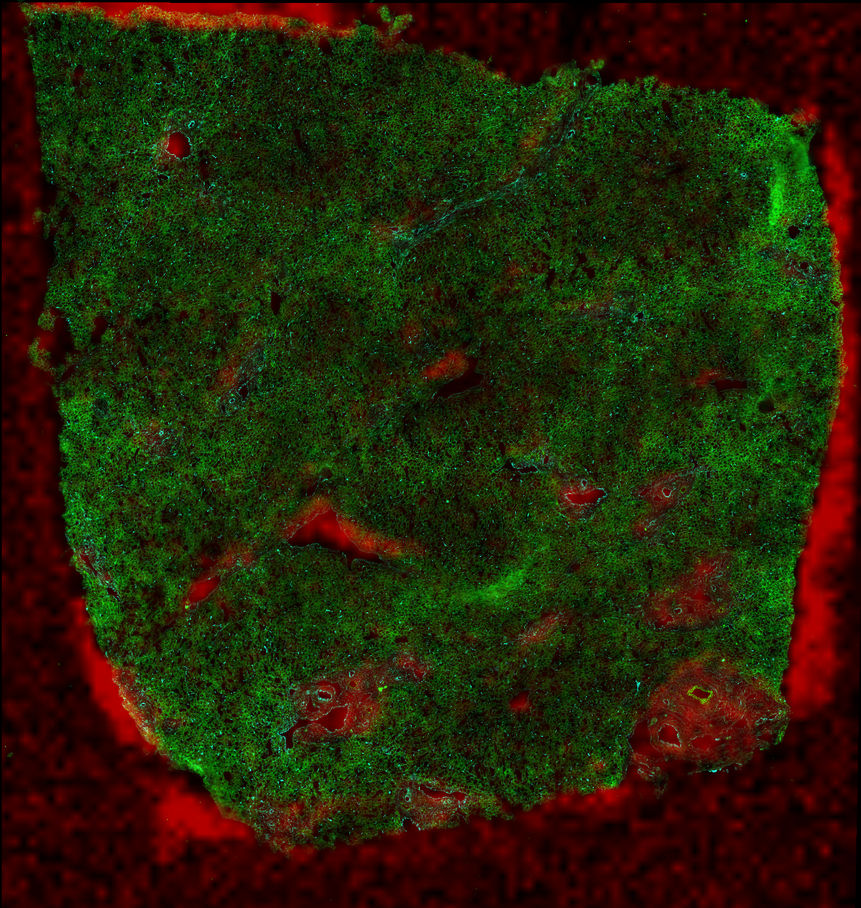

# Multimodal Spatial Integration

Cross-Modal Spatial Registration of Xenium, METASPACE, and PRIDE-derived Features for Joint Analysis of Tissue Microenvironments

## Project Overview

This project implements a **landmark-based spatial registration pipeline** to align low-resolution DESI (Desorption Electrospray Ionization) mass spectrometry images with high-resolution 10x Genomics Xenium in situ transcriptomics data. The goal is to enable joint analysis of metabolomic and transcriptomic features within the same tissue microenvironment.

### Datasets

| Modality | Sample | Resolution | Channels |
|----------|--------|-----------|----------|
| **Xenium** | FFPE Human Tissue (55588 region 4) | 0.2125 um/pixel | DAPI, ATP1A1/CD45/E-Cadherin, 18S, AlphaSMA/Vimentin |
| **DESI-MSI** | Consecutive tissue section | 40 um/pixel | 88 m/z channels (4 selected: mz 204.13, Heme B 616.25, PE/PS 731.65, PE/PS 734.60) |

### Notebooks

- **`code/Xenium_5k_data_analysis_journey_python.ipynb`**: Single-cell spatial transcriptomics analysis pipeline (QC, clustering, spatial statistics) for lung and breast cancer Xenium datasets
- **`code/DESI_Xenium_Registration.ipynb`**: Cross-modal registration of DESI and Xenium images (original notebook, described below)

## DESI-Xenium Registration Workflow

The registration notebook (`DESI_Xenium_Registration.ipynb`) performs the following steps:

### 1. Data Loading

- Load Xenium output into a `SpatialData` object via `spatialdata_io.xenium()`
- Load the 3D DESI OME-TIFF (88 m/z channels, 107 x 102 pixels at 40 um/pixel)
- Select biologically relevant DESI channels and parse them into a `spatialdata` `Image2DModel` with appropriate scale transforms

### 2. Channel Extraction and Visualization

Extract matched channel pairs from both modalities for visual comparison and registration:

- **Xenium**: AlphaSMA/Vimentin (vessels), ATP1A1/CD45/E-Cadherin (membranes), DAPI (nuclei)
- **DESI**: Heme B 616.25 (vessels), PE/PS 731.65 (membranes), mz 204.13, PE/PS 734.60

The DESI image is flipped along the x-axis to match Xenium orientation.


*Individual DESI mass spectrometry imaging channels (top row from the left: Heme B 616.25, Xenium Morphology (AlphaSMA/Vimentin and ATP1A1/CD45/E-Cadherin), PE/PS 734.60. Bottom row from the left: m/z 204.13, PE/PS 731.65) visualized together in napari. Each channel is rendered with a distinct colormap to highlight tissue morphology across modalities.*

### 3. Composite Image Generation

RGB composite images are created for both modalities using matched biological features:
- **Red channel**: Vessel markers (AlphaSMA <-> Heme B)
- **Green channel**: Membrane markers (ATP1A1 <-> Lipid 731.65)

### 4. Landmark Selection

Corresponding landmark points are placed on both images using QuPath and exported as TSV files. A total of 12 landmark pairs were selected across tissue boundaries, vessel structures, and other identifiable features to guide the affine registration.


*Landmark points placed on the Xenium morphology image (AlphaSMA/Vimentin in red, ATP1A1/CD45/E-Cadherin in green) using QuPath. Each colored circle marks a corresponding anatomical feature used for registration.*


*Matching landmark points placed on the DESI Heme B (616.25 m/z) channel. Points are numbered to correspond with the Xenium landmarks above.*

Landmarks are matched by point number extracted from the exported TSV files, and pixel coordinates are converted to physical micron coordinates (Xenium x 0.2125, DESI x 40.0) to establish a common physical coordinate system.

### 5. Affine Registration with SimpleITK

Both images are converted to SimpleITK format with correct physical spacing, and the paired landmark coordinates (flattened to `[x1, y1, x2, y2, ...]` format as required by SimpleITK) are used to compute a 2D affine transformation via `sitk.LandmarkBasedTransformInitializer`. The derived affine parameters include rotation, scale, and translation components.

### 6. Image Resampling and Overlay

The DESI image is resampled into the Xenium coordinate space using the computed affine transformation via `sitk.Resample`, producing a registered DESI image at Xenium resolution (0.2125 um/pixel). Per-landmark registration errors are computed as Euclidean distances between transformed moving landmarks and fixed landmarks.


*Result of the landmark-based affine registration: the DESI Heme B channel (red) resampled and overlaid onto the Xenium AlphaSMA/Vimentin morphology channel (green) in the same coordinate space. The overlap of tissue boundaries confirms the spatial alignment between the two modalities.*

## Project Structure

```
multimodal_spatial_integration/
├── code/
│   ├── DESI_Xenium_Registration.ipynb              # Original registration notebook
│   ├── Xenium_5k_data_analysis_journey_python.ipynb # Xenium analysis notebook
│   ├── 01_create_spatial_data_object/
│   │   └── create_sdata.py
│   ├── 02_channel_extraction/
│   │   └── extract_channels.py
│   ├── 03_visualization/
│   │   └── visualize_channels.py
│   ├── 04_landmark_selection/
│   │   └── landmark_selection.ipynb    # Markdown-only (manual QuPath step)
│   ├── 05_landmark_registration/
│   │   └── register_landmarks.py
│   └── 06_apply_registration/
│       └── apply_transform.py
├── data/
│   ├── raw/
│   │   ├── xenium/       # Xenium instrument output
│   │   └── msi/          # DESI OME-TIFF files
│   ├── 01_create_spatial_data_object/
│   │   └── sdata_object.zarr
│   ├── 02_channel_extraction/
│   │   └── desi_flipped.ome.tif
│   ├── 03_visualization/            # (no data outputs)
│   ├── 04_landmark_selection/
│   │   └── *.tsv                    # Landmark exports from QuPath
│   ├── 05_landmark_registration/
│   │   └── landmarks.csv
│   ├── 06_apply_registration/
│   │   └── desi_registered.tif
│   ├── xenium/processed/            # Zarr files, clustering results (Xenium notebook)
│   ├── breast.zarr                  # Breast cancer SpatialData object
│   ├── proteomics/                  # (planned)
│   └── external/                    # External reference data
├── images/
│   ├── Channels_DESI_Xenium_Test.png
│   ├── Xenium_Landmarks.png
│   ├── DESI_Landmarks.png
│   └── Registered_Image_Using_Landmarks.png
├── requirements.txt
├── xenium_scverse_py310.lock.txt
└── README.md
```

## Pipeline Scripts

The registration workflow from the notebook has been refactored into standalone Python scripts, organized in numbered step folders. Each step folder under `code/` has a corresponding data folder under `data/` with the same name.

### `01_create_spatial_data_object/create_sdata.py`

Loads raw Xenium and DESI data, combines them into a single SpatialData object, and writes it to a Zarr store.

| | |
|---|---|
| **Arguments** | None |
| **Input Data** | `data/raw/xenium/output-XETG00169__0055588__55588_region_4__20250418__182706/` (Xenium instrument output) |
| | `data/raw/msi/3D_DESI_F5_Pos mode_40um_F5_5pos_40um_Features110425.ome.tif` (DESI 88-channel OME-TIFF) |
| **Output Data** | `data/01_create_spatial_data_object/sdata_object.zarr` (combined SpatialData with Xenium + DESI) |

### `02_channel_extraction/extract_channels.py`

Reads the combined SpatialData object, extracts biologically relevant Xenium morphology channels at full resolution, flips the DESI image along the x-axis to match Xenium orientation, saves the flipped image (all 88 channels), and creates RGB composite images for visual comparison.

| | |
|---|---|
| **Arguments** | None |
| **Input Data** | `data/01_create_spatial_data_object/sdata_object.zarr` |
| **Output Data** | `data/02_channel_extraction/desi_flipped.ome.tif` (flipped 88-channel DESI image) |

### `03_visualization/visualize_channels.py`

Opens an interactive napari viewer with Xenium morphology channels and DESI mass spectrometry channels overlaid at their respective physical scales, along with RGB composite images.

| | |
|---|---|
| **Arguments** | None |
| **Input Data** | `data/01_create_spatial_data_object/sdata_object.zarr` |
| | `data/02_channel_extraction/desi_flipped.ome.tif` |
| **Output Data** | None (interactive visualization only) |

### `04_landmark_selection/landmark_selection.ipynb`

Markdown-only notebook documenting the manual QuPath workflow for placing corresponding landmark points on the flipped DESI image and the Xenium morphology image. The exported TSV files are saved to the step's data folder.

| | |
|---|---|
| **Arguments** | N/A (manual step in QuPath) |
| **Input Data** | `data/02_channel_extraction/desi_flipped.ome.tif` (opened in QuPath) |
| | Xenium `morphology_focus_0002.ome.tif` from the raw Xenium output (opened in QuPath) |
| **Output Data** | `data/04_landmark_selection/morphology_focus_0002.ome.tif-points.tsv` (Xenium landmarks) |
| | `data/04_landmark_selection/3D_DESI_F5_Pos mode_40um_Flipped.ome.tif - Image0-points.tsv` (DESI landmarks) |

### `05_landmark_registration/register_landmarks.py`

Loads QuPath-exported landmark TSV files, extracts point numbers, converts pixel coordinates to physical micron coordinates, merges matched landmark pairs into a single table, computes a 2D affine transformation using SimpleITK, and evaluates per-landmark registration errors.

| | |
|---|---|
| **Arguments** | None |
| **Input Data** | `data/04_landmark_selection/*.tsv` (landmark exports from QuPath) |
| | `data/01_create_spatial_data_object/sdata_object.zarr` (for Xenium reference channel) |
| | `data/02_channel_extraction/desi_flipped.ome.tif` (for DESI reference channel) |
| **Output Data** | `data/05_landmark_registration/landmarks.csv` (merged landmark table with physical coordinates) |

### `06_apply_registration/apply_transform.py`

Recomputes the affine transformation from the saved landmarks, resamples the DESI image into the Xenium coordinate space using SimpleITK, and saves the registered image as a TIFF file.

| | |
|---|---|
| **Arguments** | None |
| **Input Data** | `data/05_landmark_registration/landmarks.csv` |
| | `data/01_create_spatial_data_object/sdata_object.zarr` (for Xenium reference image) |
| | `data/02_channel_extraction/desi_flipped.ome.tif` (for DESI source image) |
| **Output Data** | `data/06_apply_registration/desi_registered.tif` (DESI resampled to Xenium resolution at 0.2125 um/pixel) |

## Environment Setup (macOS, Python 3.10)

This project uses the **scverse / spatialdata ecosystem** for analysis of **10x Genomics Xenium In Situ** data. Because `spatialdata`, `spatialdata-io`, `anndata`, and `dask` are tightly coupled, the environment must be **carefully pinned** to ensure stability and reproducibility. The configuration below has been **fully tested and validated** on macOS (Apple Silicon and Intel).

**Python version:** 3.10.x
Python >=3.11 is intentionally not used because `anndata>=0.12` requires Python >=3.11 and is incompatible with this stack, while `scanpy 1.11.x` and `spatialdata 0.4.0` are most stable on Python 3.10.

### Environment creation and activation
```bash
brew install python@3.10
$(brew --prefix python@3.10)/bin/python3.10 -m venv ~/envs/xenium_scverse_py310
source ~/envs/xenium_scverse_py310/bin/activate
pip install --upgrade pip
pip install uv
```

### Dependency specification (requirements.txt)

```
setuptools<81

spatialdata[extra]==0.4.0
spatialdata-io==0.1.7

scanpy==1.11.2
squidpy==1.6.5
anndata==0.10.9

scikit-misc==0.5.1
harmonypy==0.0.10
geosketch==1.3
igraph==0.11.8

dask[dataframe]>=2024.1.0,<2024.8.0
distributed>=2024.1.0,<2024.8.0
dask-expr<1.1.0

```

### Install dependencies
```bash
uv pip install --force-reinstall -r requirements.txt
```

### Dask configuration (required)

Enable the new Dask DataFrame query-planning backend to avoid legacy behavior and future breakage. Add the following line to ~/.zshrc and reload the shell.

```bash
export DASK_DATAFRAME__QUERY_PLANNING=True
source ~/.zshrc
```

### Environment validation (smoke test)

```bash
python -c "
import spatialdata
import spatialdata_io
import scanpy
import squidpy
print('Environment OK')
"
```

### Environment summary

| Package | Version |
|---------|---------|
| Python | 3.10.x |
| spatialdata | 0.4.0 |
| spatialdata-io | 0.1.7 |
| scanpy | 1.11.2 |
| squidpy | 1.6.5 |
| anndata | 0.10.9 |

### Version compatibility notes

- `spatialdata-io` must match the installed spatialdata API
- `anndata>=0.12` requires Python >=3.11 and is not compatible with this setup
- Dask versions >=2024.8 may break spatialdata imports
- All versions listed above were validated together on macOS

### Reproducibility

```bash
uv pip freeze > xenium_scverse_py310.lock.txt
```

## Known Issues and Fixes

### Xenium Parquet Compatibility (Polars -> PyArrow)

Newer Xenium instrument runs (April 2025+) output parquet files written by **Polars**, which use parquet format features that **pyarrow cannot decode**. This causes an `OSError: Unexpected end of stream` when loading data with `spatialdata_io.xenium()`. The files are not corrupted -- they are simply incompatible with pyarrow's reader.

**Affected files:** `cells.parquet`, `transcripts.parquet`

#### Fix

Install Polars in your environment, then re-write the affected files as pyarrow-compatible parquet:

```bash
source ~/envs/xenium_scverse_py310/bin/activate
pip install polars
```

```python
import polars as pl
import shutil
from pathlib import Path

raw_data_path = Path("data/raw/xenium/<your_xenium_output_folder>")

for fname in ["cells.parquet", "transcripts.parquet"]:
    f = raw_data_path / fname
    df = pl.read_parquet(f)
    df.to_pandas().to_parquet(f.with_suffix(".parquet.bak"))
    shutil.move(f, f.with_suffix(".parquet.original"))  # preserve original
    shutil.move(f.with_suffix(".parquet.bak"), f)        # replace with compatible version
```

The original Polars-written files are preserved with a `.original` extension. After conversion, `xenium(raw_data_path)` will load without errors.

### SpatialData Write Fails with `TypeError: Object of type Scale is not JSON serializable`

When calling `sdata.write()` on a `SpatialData` object that contains **Points** elements (e.g. transcripts), `spatialdata==0.4.0` raises the following error:

```
TypeError: Object of type Scale is not JSON serializable

File spatialdata/_io/io_points.py, line 73, in write_points
    points.to_parquet(path)
```

**Root cause:** Newer versions of `pyarrow` serialize the `.attrs` dictionary of a pandas/dask DataFrame when writing to parquet. The `points` DataFrame carries spatialdata transformation objects (e.g. `Scale`, `Affine`) in `.attrs["transform"]`, which are not JSON-serializable. Previously `pyarrow` silently ignored `.attrs`, but recent versions attempt to serialize them as parquet metadata, causing the failure.

**Affected file:** `spatialdata/_io/io_points.py` (line 73 in `write_points()`)

This bug is fixed upstream in [spatialdata PR #1003](https://github.com/scverse/spatialdata/pull/1003), but the fix is not included in the pinned `spatialdata==0.4.0` release used by this project.

#### Fix

Apply the patch manually to your installed `spatialdata` package:

```bash
# Find the file to patch
SITE_PACKAGES=$(python -c "import spatialdata, os; print(os.path.dirname(spatialdata.__file__))")
echo "Patching: $SITE_PACKAGES/_io/io_points.py"
```

Open `$SITE_PACKAGES/_io/io_points.py` and locate the `write_points()` function (around line 73). Replace:

```python
    points.to_parquet(path)
```

with:

```python
    points_without_transform = points.copy()
    del points_without_transform.attrs["transform"]
    points_without_transform.to_parquet(path)
```

This copies the DataFrame, removes the non-serializable `transform` key from the copy's `.attrs`, and writes the clean copy to parquet. The original `points` object (with transforms intact) is still used for the zarr metadata writes that follow.

**Note:** This patch is applied directly to the installed package in `~/envs/xenium_scverse_py310/` and is **not tracked in git**. It will need to be re-applied if the environment is recreated.
